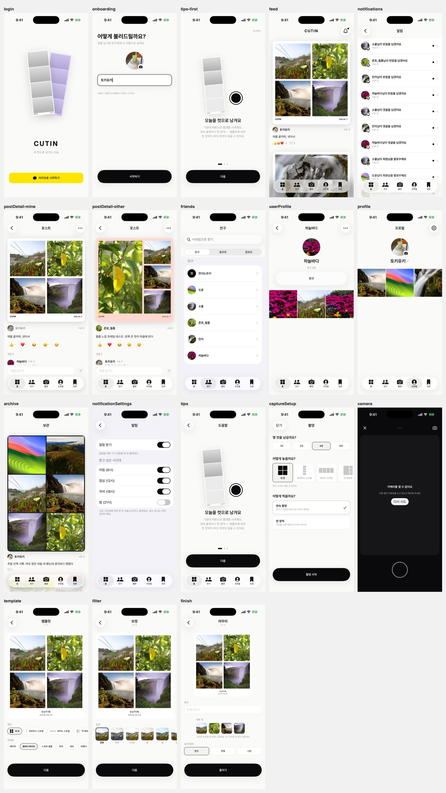

<div align="center">

# CUTIN for iOS

**Shoot four cuts, weave them into a template, and share them with friends** — the native SwiftUI client

[](#requirements)
[](https://www.swift.org)
[](https://developer.apple.com/xcode/)
[](./LICENSE)

[한국어](./README.md) · **English**

</div>

---

## Overview

**CUTIN** lets you shoot several cuts with the camera, compose them into a single image using templates and filters, and share the result as posts — with reactions and comments from friends. This repository is its **native iOS client**, built on SwiftUI and the iOS 26 Liquid Glass APIs, leaning almost entirely on first-party frameworks.

See [CUTIN-FEATURES.md](./CUTIN-FEATURES.md) for the full feature specification (Korean).

<div align="center">

</div>

## Features

- **Multi-cut capture** — custom AVFoundation camera: 3·2·1 countdown, pinch-to-zoom, "resume later" drafts, retake
- **Three-step editing** — pick a template → adjust (7 Core Image filters) → finish (thumbnail cut, caption, visibility)
- **Composition** — a baking pipeline that lays the captured cuts into the server template's slot coordinates as one image
- **Feed & posts** — cursor-paginated feed, detail, share, save to Photos, bookmark, delete
- **Social** — reactions · comments · follow · block · report
- **Friends & profile** — other users' profiles, nickname editing, thumbnail-first 3-column grid
- **Notifications** — in-app list (unread badge) · read tracking · settings · APNs device registration
- **Auth** — Kakao login + onboarding. Tokens kept in the Keychain, automatic 401 refresh
- **Sound & haptics** — iOS's own system sounds, toggleable in settings

## Tech Stack

| Area | Technology |
|---|---|
| Language | **Swift 6.0** (strict concurrency) |
| UI | **SwiftUI** · Observation (`@Observable`) · iOS 26 Liquid Glass |
| Camera & media | AVFoundation (custom capture) · Core Image (filters & compositing) · PhotosUI |
| Networking | Custom `URLSession`-based `APIClient` (actor) · cursor paging · media upload |
| Security | Security framework (Keychain — refresh tokens) |
| Notifications | UserNotifications · APNs |
| Login | Kakao iOS SDK 2.28.0 |
| Deployment target | iOS 26.0 |

The only third-party dependency is the **Kakao login SDK**; `Alamofire` comes in transitively through it and is not used directly. Everything else is first-party Apple frameworks.

## Getting Started

### Requirements

- **Xcode 26+** (iOS 26 SDK — Liquid Glass APIs such as `glassEffect`)
- A physical device or simulator running iOS 26.0+
- Some features (camera, save-to-Photos) work **only on a physical device** — the simulator has no camera

### Clone & Run

```bash
git clone https://github.com/Sapurepo/cutin-ios.git
cd cutin-ios
open Cutin.xcodeproj   # open in Xcode and Run the Cutin scheme
```

To verify compilation only, without signing, on a simulator:

```bash
xcodebuild -scheme Cutin -destination 'generic/platform=iOS Simulator' \
  CODE_SIGNING_ALLOWED=NO build
```

> Personal Team (free account) signing **expires every 7 days**. If the app won't launch on device, just Run again from Xcode.

### Configuration

Build settings live in `Config/*.xcconfig`.

| Key | Location | Description |
|---|---|---|
| `DEVELOPMENT_TEAM` | `Shared.xcconfig` | Replace with your own Apple Developer team ID for device runs |
| `CUTIN_KAKAO_APP_KEY` | `Shared.xcconfig` | Kakao native app key (a client identifier, not a secret) |
| `CUTIN_API_BASE_URL` | `Debug.xcconfig` | Local backend URL. Release intentionally crashes on the first call if the production URL is empty |

> The `//` in the API URL is injected via the `CUTIN_SLASH` variable in `Shared.xcconfig` because of xcconfig comment rules — see the comments in that file.

## Project Structure

```
Cutin/
  CutinApp.swift      @main — builds the transport layer and app-lifetime state, injected via environment
  RootView.swift      tab shell (Liquid Glass) · capture cover · draft-block sheet
  Auth/               login gate · Kakao login · session · token storage (Keychain)
  Network/            API base URL · errors · transport (actor) · Contracts/ (server contract types)
  Navigation/         AppTab · Route · AppCoordinator (owns tabs & capture cover)
  DesignSystem/       tokens · typography · Components/ · SoundEffects · Haptics
  Domain/             domain models
  Capture/            custom AVFoundation camera · capture flow state
  Compose/            Core Image filters · templates/frames · composition · 3-step editor · publishing
  Storage/            file-access rules · cut JPEGs · draft persistence
  Feed/ Friends/      feed·detail·comments / friends·follow·block·report
  Archive/ Profile/   bookmarks · profile
  Resources/Fonts/    Pretendard (Korean) · Geist (Latin-only)
Config/               Shared/Debug/Release.xcconfig · Info.plist
Scripts/              runtime-verification harness (stands in for a test target)
Design/               UI-overhaul decision records · audit contact sheets
```

`Cutin/` is an Xcode **file system synchronized group** — dropping a `.swift` file into a folder adds it to the target automatically, without touching the project file.

## Verification

There is no test target; instead `Scripts/` holds per-flow runtime-verification harnesses (contract, auth, composition, upload, publishing, social, notifications, thumbnail, UI audit, …). Each folder's README documents the procedure and a **negative control** (deliberately break it and confirm it fails). `Scripts/` is outside the app target and is not compiled.

## Contributing

Outside contributions are welcome. Please follow the flow below.

### Branch strategy

- `dev` — the default, integration branch. Everything lands here first
- `release/x.y.z` — release-preparation branches
- `feature/*` — feature and fix branches

`dev`, `main`, and `release/*` are **protected branches**. Direct pushes are blocked; changes merge only through a **Pull Request with maintainer review approval**.

### Workflow

1. Fork the repo or create a `feature/*` branch
2. Commit your changes — commit messages follow `[TYPE] description` (`FEATURE` · `FIX` · `UPDATE` · `DOCS` · `RELEASE`)
3. Open a Pull Request against `dev`
4. It merges after maintainer review approval

### Code guidelines

- Respect Swift 6 strict concurrency (`@MainActor` boundaries, `Sendable`)
- New files are picked up automatically when placed in a folder (don't touch `.xcodeproj` directly — `pbxproj` changes belong on the release-prep branch only)
- Match the existing style and comment density

## Related Repositories

| Repository | Role |
|---|---|
| [`cutin-ios`](https://github.com/Sapurepo/cutin-ios) | main client (this repo) |
| [`cutin-frontend`](https://github.com/Sapurepo/cutin-frontend) | admin (Next.js) + legacy RN app |
| [`cutin-backend`](https://github.com/Sapurepo/cutin-backend) | API server |

Android is postponed indefinitely (spec §0.1) — a solo developer can't maintain two native codebases.

## License

[MIT License](./LICENSE) © 2026 Sapu
