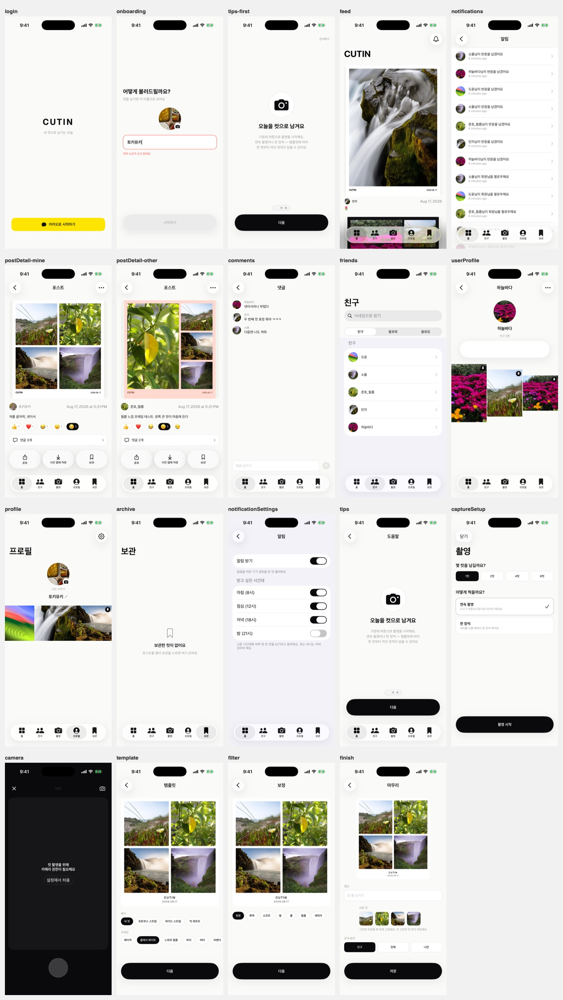

<div align="center">

# CUTIN for iOS

**네 컷을 찍어 템플릿으로 엮고, 친구와 나누는 소셜 기록 앱** — SwiftUI 네이티브 클라이언트

[](#요구-사항)
[](https://www.swift.org)
[](https://developer.apple.com/xcode/)
[](./LICENSE)

**한국어** · [English](./README.en.md)

</div>

---

## 소개

**CUTIN**은 카메라로 여러 컷을 찍어 템플릿·필터로 한 장의 이미지로 합성하고, 친구들과 포스트를 공유하며 반응·댓글을 남기는 소셜 기록 서비스입니다. 이 저장소는 그 **iOS 네이티브 클라이언트**로, SwiftUI와 iOS 26의 Liquid Glass API 위에 순정 프레임워크 중심으로 구현돼 있습니다.

기능 명세 전문은 [CUTIN-FEATURES.md](./CUTIN-FEATURES.md)를 참고하세요.

<div align="center">

</div>

## 주요 기능

- **N컷 촬영** — AVFoundation 커스텀 카메라. 3·2·1 카운트다운, 핀치 줌, "나중에 이어서" 임시저장, 재촬영
- **편집 3단계** — 템플릿 선택 → 보정(Core Image 필터 7종) → 마무리(대표 컷·캡션·공개 범위)
- **N컷 합성** — 촬영한 컷을 서버 템플릿의 슬롯 좌표에 맞춰 한 장의 이미지로 굽는(baking) 파이프라인
- **피드 · 포스트** — 커서 페이징 피드, 상세, 공유, 사진 앱 저장, 보관(북마크), 삭제
- **소셜** — 반응 · 댓글 · 팔로우 · 차단 · 신고
- **친구 · 프로필** — 타인 프로필, 닉네임 편집, 대표 컷 우선 3열 그리드
- **알림** — 인앱 알림 목록(미읽음 배지) · 읽음 처리 · 설정 · APNs 디바이스 등록
- **인증** — 카카오 로그인 + 온보딩. 토큰은 Keychain 보관, 401 자동 재발급
- **효과음 · 햅틱** — iOS 자체 시스템 사운드, 설정에서 켜고 끄기

## 기술 스택

| 영역 | 사용 기술 |
|---|---|
| 언어 | **Swift 6.0** (strict concurrency) |
| UI | **SwiftUI** · Observation (`@Observable`) · iOS 26 Liquid Glass |
| 카메라 · 미디어 | AVFoundation (커스텀 캡처) · Core Image (필터·합성) · PhotosUI |
| 네트워크 | `URLSession` 기반 자체 `APIClient` (actor) · 커서 페이징 · 미디어 업로드 |
| 보안 | Security (Keychain — 리프레시 토큰) |
| 알림 | UserNotifications · APNs |
| 로그인 | Kakao iOS SDK 2.28.0 |
| 최소 지원 | iOS 26.0 |

외부 의존성은 **카카오 로그인 SDK 하나**뿐이며, `Alamofire`는 그 전이 의존입니다(직접 사용하지 않음). 그 외에는 모두 애플 순정 프레임워크입니다.

## 시작하기

### 요구 사항

- **Xcode 26** 이상 (iOS 26 SDK — `glassEffect` 등 Liquid Glass API)
- iOS 26.0 이상의 실기기 또는 시뮬레이터
- 카메라·사진 앱 저장 등 일부 기능은 **실기기에서만** 동작합니다 (시뮬레이터에 카메라가 없음)

### 클론 & 실행

```bash
git clone https://github.com/Sapurepo/cutin-ios.git
cd cutin-ios
open Cutin.xcodeproj   # Xcode에서 열어 Cutin 스킴을 Run
```

시뮬레이터에서 서명 없이 컴파일만 검증하려면:

```bash
xcodebuild -scheme Cutin -destination 'generic/platform=iOS Simulator' \
  CODE_SIGNING_ALLOWED=NO build
```

> 개인 팀(무료 계정) 서명은 **7일마다 인증서가 만료**됩니다. 기기에서 앱이 실행되지 않으면 Xcode에서 다시 Run 하세요.

### 설정

빌드 설정은 `Config/*.xcconfig`에 모여 있습니다.

| 키 | 위치 | 설명 |
|---|---|---|
| `DEVELOPMENT_TEAM` | `Shared.xcconfig` | 실기기 실행 시 본인 Apple 개발 팀 ID로 교체 |
| `CUTIN_KAKAO_APP_KEY` | `Shared.xcconfig` | 카카오 네이티브 앱 키(클라이언트 식별자, 비밀값 아님) |
| `CUTIN_API_BASE_URL` | `Debug.xcconfig` | 로컬 백엔드 주소. Release는 운영 주소가 비어 있으면 첫 호출에서 의도적으로 크래시 |

> API 주소의 `//`는 xcconfig 주석 규칙 때문에 `Shared.xcconfig`의 `CUTIN_SLASH` 변수로 넣습니다 — 해당 파일 주석을 참고하세요.

## 프로젝트 구조

```
Cutin/
  CutinApp.swift      @main — 전송 계층과 앱 수명 상태를 만들어 환경으로 내린다
  RootView.swift      탭 셸(Liquid Glass) · 촬영 커버 · draft 차단 시트
  Auth/               로그인 게이트 · 카카오 로그인 · 세션 · 토큰 보관(Keychain)
  Network/            API 주소 · 오류 · 전송(actor) · Contracts/(서버 계약 타입)
  Navigation/         AppTab · Route · AppCoordinator(탭·촬영 커버 소유)
  DesignSystem/       토큰 · 타이포그래피 · Components/ · SoundEffects · Haptics
  Domain/             도메인 모델
  Capture/            AVFoundation 커스텀 카메라 · 촬영 플로우 상태
  Compose/            Core Image 필터 · 템플릿/프레임 · N컷 합성 · 편집 3단계 · 발행
  Storage/            파일 접근 규칙 · 컷 JPEG · draft 영속
  Feed/ Friends/      피드·상세·댓글 / 친구·팔로우·차단·신고
  Archive/ Profile/   보관 · 프로필
  Resources/Fonts/    Pretendard(한글) · Geist(라틴 전용)
Config/               Shared/Debug/Release.xcconfig · Info.plist
Scripts/              실행 검증 하니스 (테스트 타깃 대체)
Design/               UI 개편 판단 기록 · 감사 콘택트 시트
```

`Cutin/`은 Xcode의 **file system synchronized group**입니다 — 폴더에 `.swift` 파일을 추가하면 프로젝트 파일을 건드리지 않아도 자동으로 타깃에 포함됩니다.

## 검증

테스트 타깃이 없는 대신, `Scripts/`에 흐름별 실행 검증 하니스가 있습니다(계약·인증·합성·업로드·발행·소셜·알림·대표 컷·UI 감사 등). 각 폴더 README에 절차와 **음성 대조군**(일부러 깨뜨려 실패가 나오는지)이 적혀 있습니다. `Scripts/`는 앱 타깃 밖이라 컴파일되지 않습니다.

## 기여하기

외부 기여를 환영합니다. 아래 흐름을 따라주세요.

### 브랜치 전략

- `dev` — 기본·통합 브랜치. 모든 기능이 여기로 모입니다
- `release/x.y.z` — 릴리즈 준비 브랜치
- `feature/*` — 기능·수정 작업 브랜치

`dev` · `main` · `release/*`는 **보호된 브랜치**입니다. 직접 푸쉬가 막혀 있으며, 오직 **Pull Request + 메인테이너 리뷰 승인**을 거쳐야 병합됩니다.

### 작업 흐름

1. 저장소를 포크하거나 `feature/*` 브랜치를 만듭니다
2. 변경을 커밋합니다 — 커밋 메시지는 `[TYPE] 설명` 형식 (`FEATURE` · `FIX` · `UPDATE` · `DOCS` · `RELEASE`)
3. `dev`를 대상으로 Pull Request를 엽니다
4. 메인테이너 리뷰 승인 후 병합됩니다

### 코드 규칙

- Swift 6 strict concurrency를 지킵니다 (`@MainActor` 경계·`Sendable`)
- 새 파일은 해당 폴더에 두면 자동으로 타깃에 포함됩니다 (`.xcodeproj`를 직접 건드리지 마세요 — `pbxproj` 변경은 릴리즈 준비 브랜치에서만)
- 기존 스타일·주석 밀도를 따릅니다

## 관련 저장소

| 저장소 | 역할 |
|---|---|
| [`cutin-ios`](https://github.com/Sapurepo/cutin-ios) | 메인 클라이언트 (이 저장소) |
| [`cutin-frontend`](https://github.com/Sapurepo/cutin-frontend) | 어드민 (Next.js) + 기존 RN 앱 |
| [`cutin-backend`](https://github.com/Sapurepo/cutin-backend) | API 서버 |

Android는 무기한 연기합니다 (명세 §0.1) — 1인 개발 체제에서 네이티브 2벌은 유지할 수 없습니다.

## 라이선스

[MIT License](./LICENSE) © 2026 Sapu
